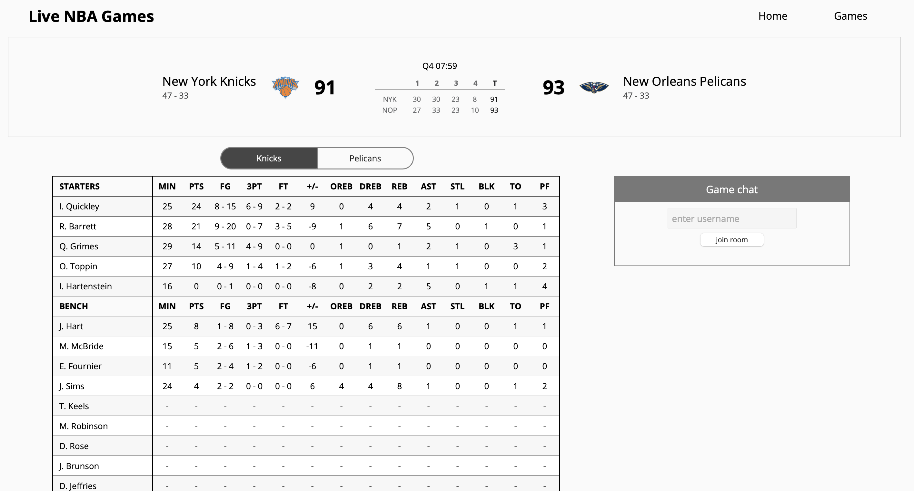
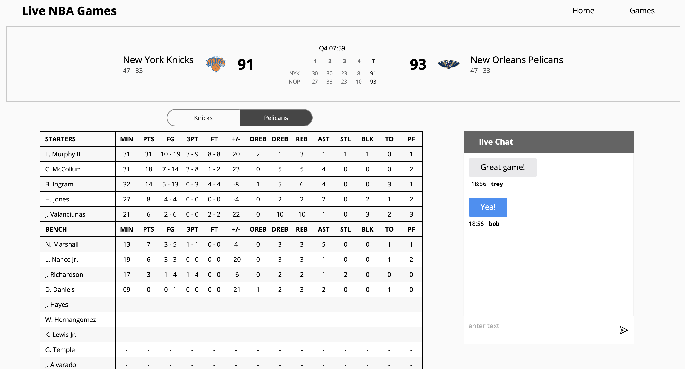

<h3 align="center"> 
NOTE: It won't work when you clone it due to out-of-date packages.
</h3>

<h4 align="center"> 
 Welcome to Live NBA Games
</h4>

<h4 align="center">
This shows live NBA scores and boxscores. Users can chat with other users in the live chat.
</h4>

<h3 align="center"> Preview </h3>

